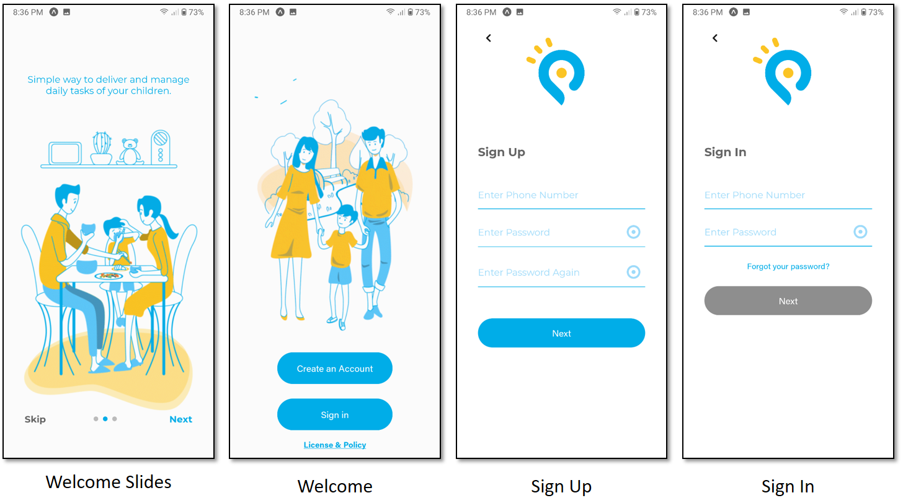
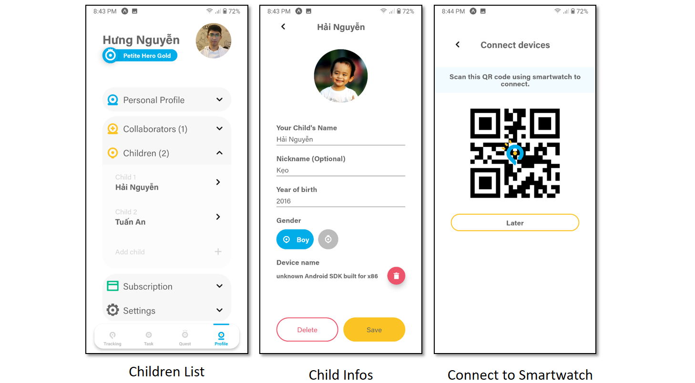
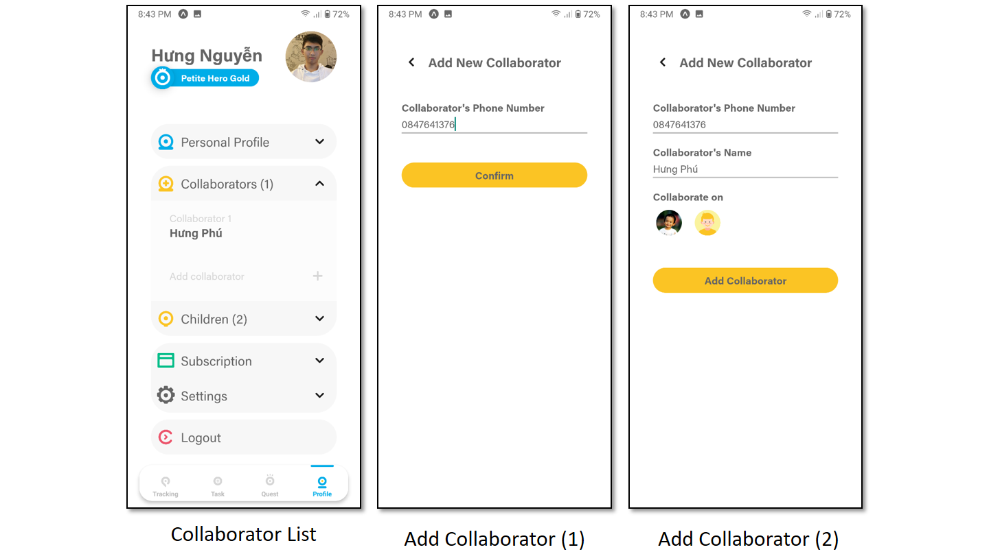

# [PETITE HERO](https://github.com/petite-hero) - FPT University Capstone Project

__*Petite Hero - Children Management and Development Application*__ is an inter-specialization project for FPT University graduation thesis, realized by Software Engineering and Graphic Design students.

The project's product consists of 4 main components:
- A [Server](https://github.com/petite-hero/petite-hero-api) for requests handling
- A [Mobile Application](https://github.com/petite-hero/petite-hero-mobile) for parents
- A [Smartwatch Application](https://github.com/petite-hero/petite-hero-smartwatch) for children
- A [Web Application](https://github.com/petite-hero/petite-hero-web) for administrators

__*Official TVC*__: https://youtu.be/8nKs7YcEEaE  
__*Project Demonstration*__: https://youtu.be/i3ZhxKtDCWA  

# Contributors

__*Software Engineering Specialization*__:
- [Nguyễn Phú Hưng](https://github.com/hulk1999)
- [Võ Lam Trường](https://github.com/truongvlit)
- [Lâm Lệ Dương](https://github.com/llduong)
- [Âu Đức Tuấn](https://github.com/ibenrique2510)

__*Graphic Design Specialization*__:
- Hàn Lê Khanh
- Trần Nguyễn An Khang

# 
# Petite Hero - Mobile Application
- Language: Javascript
- Framework: React Native
- OS: Android 10
- Developed on VSCode

# Functionalities
1. Authentication
2. Location Setting & Management
3. Task Management
4. Achievement Management
5. Profile Management
6. Subscription Management

# Installation Instructions
1. Clone down this repository. You need `npm` and `expo` installed globally on your machine.
2. If not, access and follow the instructions writen in these links below.
	* Npm installation: https://nodejs.org/en/download/
	* Expo installation: https://docs.expo.io/get-started/installation/
3. Start server: `expo start`

# Screenshots
## 1. Authentication

## 2. Location Settings & Management
**Set Locations**

**Get Location Status**

## 3. Task Management

## 4. Achievement Management

## 5. Profile Management
**Profile & Language**

**Children Management**

**Collaborators Management**

## 6. Subscription Management

# Demonstration
